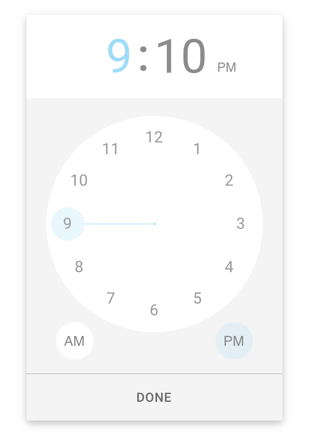

> **Fork notice:** This is a fork of the original [react-timekeeper](https://github.com/catc/react-timekeeper) project. The goal of this fork is to provide an API-compatible drop-in for newer versions of React.

<h1 align="center">
	
	<br/>
	React Timekeeper
</h1>

<p align="center">
  <a href="https://github.com/axelixlabs/react-timepicker/actions/workflows/ci.yml?query=branch%3Amaster">
    
  </a>
  <a href="https://github.com/axelixlabs/react-timepicker/blob/master/LICENSE">
    
  </a>
</p>

<p align="center">
	<b>
		Time picker based on the style of the
		<a href="https://play.google.com/store/apps/details?id=com.google.android.keep" target="_blank">
		Android Google Keep
		</a>
		app.
	</b>
</p>

------------

**Features**
- API-compatible with the original [react-timekeeper](https://github.com/catc/react-timekeeper)
- supports React 19+
- supports Node.js 18+ (developed and tested on Node.js 24)
- supports both 12 hour and 24 hour mode, and flexible time formats
- simple to use with many customizable options
- smooth, beautiful animations with [react spring](https://www.react-spring.io)
- typescript support
- css variable support for custom styles

## Installation

Requires React 19+ and Node.js 18+.

```shell
$ yarn add @axelixlabs/react-timepicker

# or via npm
$ npm install --save @axelixlabs/react-timepicker
```

If you need the original package for older React versions, use [catc/react-timekeeper](https://github.com/catc/react-timekeeper) instead.

## Usage

```javascript
import React, {useState} from 'react';
import TimeKeeper from '@axelixlabs/react-timepicker';

function YourComponent(){
  const [time, setTime] = useState('12:34pm')

  return (
    <div>
      <TimeKeeper
        time={time}
        onChange={(data) => setTime(data.formatted12)}
      />
      <span>Time is {time}</span>
    </div>
  )
}
```

All styles are inlined via [emotion](https://github.com/emotion-js/emotion) so no css imports are required.

## API
For full api and examples, see [API docs](https://axelixlabs.github.io/react-timepicker/#api) and [examples](https://axelixlabs.github.io/react-timepicker/#examples)


## Development

Requires Node.js 18 or newer. This project is developed and tested on Node.js 24.

1. Clone the repo
2. `npm install`
3. `npm run docs:dev`
4. Navigate to `localhost:3002`

### Contributing
Before submitting a PR, ensure that:
1. you follow all eslint rules (should be automatic)
1. all tests pass via `npm run tests`
1. everything builds
    - docs - `npm run docs:build`
    - lib - `npm run lib`
1. provide detailed info on what bug you're fixing or feature you're adding - if possible include a screenshot/gif

------------

Other useful commands:
- new npm releases:
  - bump version: `npm version NEW_VERSION`, commit and push - CI should publish to npm automatically
- new github releases
  - manual (TODO - add github action)
